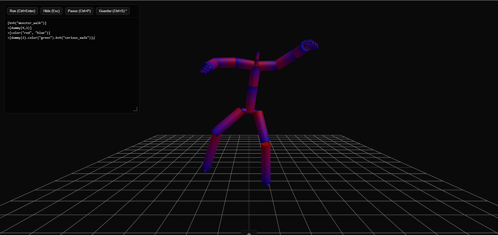

# MoveScript: Creative Coding Environment for the Artistic Exploration of Motion Capture

This tool is a web-based creative coding environment designed to transform human movement into video art. The core concept is based on a specific workflow: the user records a video of themselves performing a movement, converts it into a motion capture file (`.bvh`), and imports it into the software. 

From that moment on, their own body becomes the raw material for the artwork. Through live coding, the creator can alter time, add light trails, and apply transformations to create abstract visual compositions centered around a single performer. The goal of this project is to bridge the physical world and code, offering a space where anyone can experiment and turn their own dance or everyday gesture into a unique piece of digital art.
## Key Features
* **Fluent Choreographic API:** A high-level, chainable language designed for live performance. Sculpt your 3D scene with zero boilerplate, turning technical logic into expressive commands.
* **Skeletal & Ghost Manipulation:** Total control over body representation. Work with a solid skeleton, hide it to focus on pure geometry, or create temporal echoes with dynamic light trails.
* **Spatiotemporal Control:** Precise manipulation of the performance's fabric. Reverse the choreography, alter the playback speed to create slow-motion aesthetics, or rotate the entire universe around the dancer.

## How to Use (Getting Started)

You don't need to be a programmer to start using MotionCoder. You have two simple ways to access the environment:

### 1. Web Version (Instant Access)
The easiest way to start creating. Just open your browser and go to the live environment (no installation required):
**[Play MotionCoder on the Web](https://motioncoder.netlify.app/)**

### 2. Desktop Version (Windows .exe)
For the best performance, offline use, and the ability to load your own local `.bvh` files instantly by dragging them into your folder:
1. Go to the [Releases page](https://github.com/transper-dev/MoveScript/releases) of this repository.
2. Download the latest `MoveScript Setup.exe`.
3. Install it and start coding!

---

## For Developers (Local Build)

If you want to modify the source code, add new features, or compile your own versions, you can run the project locally using Node.js:

```bash
# 1. Clone the repository
git clone [https://github.com/transper-dev/MoveScript.git](https://github.com/transper-dev/MoveScript.git)
cd MoveScript

# 2. Install dependencies
npm install

# 3. Run locally (Development mode)
npm start 

# 4. Build for Windows (.exe)
npm run build
```

## Quick Start & Usage

Instead of writing verbose standard Three.js code, this environment uses a declarative approach. You can sculpt movement with just a few lines of code.

 

```javascript
// Example: Group manipulation and specific dummy targeting
[bvh("monster_walk")]
>[dummy(9,1)]
>[color("red", "blue")]
>[dummy(2).color("green").bvh("serious_walk")];
```
## Editor Controls (UI)
The editor is designed for a seamless live performance experience, keeping the interface minimal and out of the way:

* **Run (Ctrl + Enter):** Instantly executes the code written in the editor and updates the 3D scene.
* **Hide / Show (Esc):** Toggles the visibility of the code editor window so you can enjoy a clean, unobstructed view of your artwork.
* **Pause (Ctrl + P):** Freezes or resumes the entire 3D scene globally.
* **Save (Ctrl + S):** Instantly saves your current code state directly from the UI.
* **Drag & Resize:** The code editor is a floating window. You can drag it around the screen or resize it from the bottom-right corner to fit your workspace perfectly.
* **BVH Drawer (Bottom Menu):** Click the bottom handle to reveal an auto-generated, scrollable carousel of all your available `.bvh` motion capture files. Clicking any animation automatically injects it into your code and plays it instantly.
## API Reference (The Language)

MotionCoder uses a custom, highly declarative syntax. Instead of assigning variables or writing loops, you define a base animation and "pipe" transformations to it using brackets `[]` and arrows `>`.

### Environment Functions
These standard functions set up the global 3D scene (usually placed at the top of your code):
* **`clear()`**: Instantly clears the entire scene and resets the engine.
* **`grid(size, divisions)`**: Creates the floor grid. Defaults to `400, 10` if left empty.
* **`cam(x, y, z, lookX, lookY, lookZ)`**: Positions the camera at specific coordinates and sets its look-at target.
* **`bg(color)`**: Paints the background with a specific color (e.g., `bg("#000105")`).
* **`rot(speed)`**: Constantly rotates the entire global scene over time.

### The Declarative Syntax (Brackets & Pipes)
The core of the choreography is built using structural blocks:
* **`[bvh("name")]`**: The starting point. Loads a `.bvh` file from the assets folder and spawns the base dancer.
* **`>` (The Pipe Operator)**: Passes the current state into the next set of rules or transformations.
* **`[dummy(bones, joints)]`**: Defines the geometric resolution of the dancer. The first number sets the level of detail for the bones, and the second for the joints.
* **`[dummy(value)]`**: If you only provide one number, it applies the same geometric resolution to both the bones and the joints equally (e.g., `[dummy(5)]`).

### Properties & Modifiers
These modifiers can be applied globally to an entire group (e.g., `>[color("red")]`) or chained to a specific target (e.g., `>[dummy(2).scale(2)]`):
* **`color(color1, color2...)`**: Applies colors to the skeletons and trails. If multiple colors are provided to a group, it creates a gradient distribution.
* **`pos(x, y, z)`**: Moves the dancer or group across the 3D space.
* **`rotX(rad)`, `rotY(rad)`, `rotZ(rad)`**: Rotates the elements on a specific axis.
* **`scale(s)`**: Changes the overall size of the geometries.
* **`speed(v)`**: Playback speed multiplier (1 is normal, 2 is double, 0.5 is slow motion).
* **`trail(length)`**: Configures the ghost trail length (e.g., `trail(40)`). Use `0` to disable.
* **`skeleton(boolean)`**: Shows or hides the solid bones (`true`/`false`).

## Standard Three.js Support
Under the hood, the environment still has full access to the standard `THREE` namespace. You can always mix generative BVH animations with custom geometries, custom shaders, and traditional lighting if your artwork requires it.
